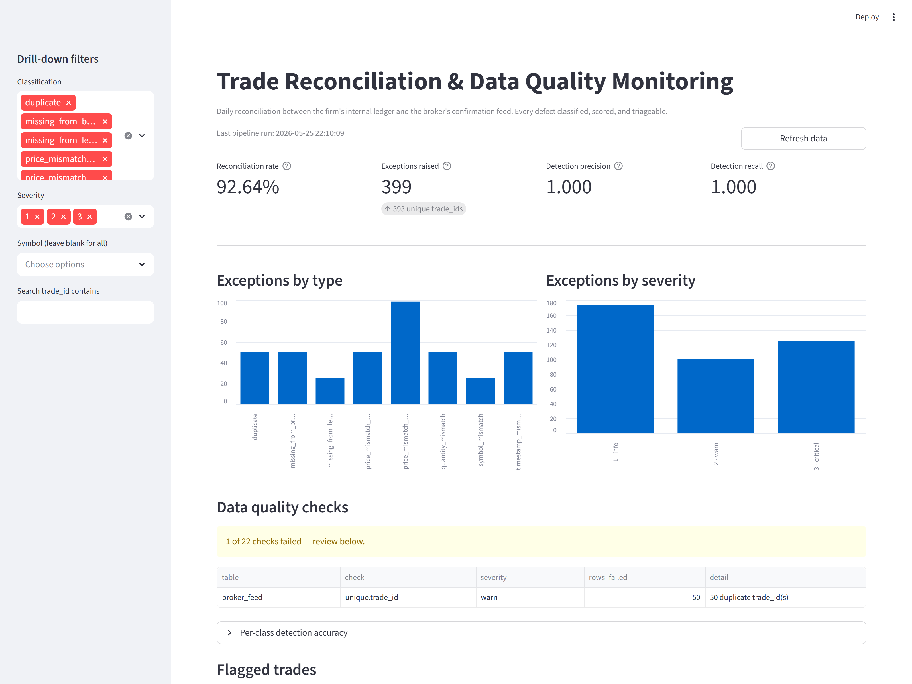

# Trade Reconciliation & Data Quality Monitoring Pipeline

An automated reconciliation tool for a trading firm's internal trade ledger
against its broker's confirmation feed. Ingests both sides, finds every
mismatch, classifies the cause, runs structural data-quality checks, and
surfaces the results in a Streamlit dashboard. Replaces the manual Excel
review pattern common in ops desks.



> Headline metrics on top, exceptions broken down by type and severity,
> a data-quality panel, and a sidebar-filtered drill-down for triage.
> On the bundled `seed=42` dataset the engine catches **100% of injected
> defects with zero false positives** across all eight types.

---

## Problem

A market-making firm executes trades through a broker. Two records exist for
every trade:

* The firm's **internal ledger** -- what the firm thinks happened.
* The broker's **confirmation feed** -- what the broker reports.

These should match exactly. They don't. Common breaks:

* The broker silently drops a fill or reports the same fill twice.
* A price is off by a fraction of a basis point (within tolerance, log it
  but don't escalate) or by a full percentage point (escalate immediately).
* A share count is wrong.
* The broker timestamp is hours off because of a timezone bug.
* A symbol is mis-typed -- one character off, easy to miss by eye.

An ops analyst typically reconciles this manually in Excel. That doesn't
scale and is hard to audit. This pipeline does it programmatically with a
measurable accuracy score, because every defect is injected synthetically
against a known ground truth.

---

## What the tool does

1. **Ingest** -- pulls real historical market data, generates a 5,000-row
   synthetic internal ledger priced off it, then produces a broker feed
   by copying the ledger and injecting eight classes of defects at
   config-driven rates. Every injection is recorded in a ground-truth
   table so detection accuracy can be measured.
2. **Load** -- writes both feeds into SQLite and runs a `FULL OUTER JOIN`
   (emulated via two `LEFT JOIN`s `UNION ALL`-ed) to find orphans on
   either side.
3. **Reconcile** -- combines the SQL orphan output with vectorised Pandas
   comparisons on the matched pairs to classify every defect (price diff
   inside / outside tolerance, quantity mismatch, symbol typo, timestamp
   shift, duplicate fill).
4. **Quality checks** -- structural validation on both feeds (schema,
   nulls, value ranges, vocabulary). Returns structured `CheckResult`
   records; never raises.
5. **Report** -- rolls everything into a JSON summary and a CSV of
   exceptions, then scores the engine's output against ground truth
   (precision, recall, F1, per-class breakdown).
6. **Dashboard** -- a Streamlit page with the headline reconciliation
   rate, charts by type and severity, a quality-checks panel, and a
   filterable drill-down table for triage.

On the bundled seed (`random_seed: 42`), the engine catches **100% of
injected defects with zero false positives** across all eight types.

---

## Architecture

```
                +----------------+
                |   config.yaml  |  (all paths, rates, thresholds)
                +--------+-------+
                         |
                         v
  +--------+   +-----------------+   +------------+   +----------------+   +--------+
  | yfinance| ->| src/ingest.py   |->| data/raw/*  |->| src/database.py |->| trades.db|
  +--------+   +-----------------+   +------------+   +-------+--------+   +----+----+
                                                              |                 |
                                                              v                 v
                                                       +---------------+   +---------------+
                                                       | src/reconcile |-->| exceptions.csv|
                                                       +------+--------+   +---------------+
                                                              |
                  +-------------------------------------------+
                  v
        +-------------------+     +-------------+     +---------------+
        | src/quality_checks|---->| QC results  |---->| src/report.py |---> summary.json
        +-------------------+     +-------------+     +-------+-------+
                                                              |
                                                              v
                                                  +----------------------+
                                                  | dashboard/app.py     |
                                                  | (Streamlit)          |
                                                  +----------------------+
```

`run_pipeline.py` is the single entry point that chains all five stages
behind a shared SQLite connection so the database is loaded once, not
once per module.

---

## Tech stack

* Python 3.10+ (typed; `from __future__ import annotations` throughout).
* Pandas + NumPy for the matched-pair comparison and scoring.
* `yfinance` for real historical market data, cached per ticker so reruns
  are offline-safe.
* Stdlib `sqlite3` -- no ORM.
* `pyyaml` for config.
* `streamlit` for the dashboard.
* `pytest` for unit tests.

---

## Project layout

```
trade-reconciliation/
+- README.md
+- requirements.txt
+- config.yaml                  # every tunable lives here
+- run_pipeline.py              # single entry point
+- data/
|  +- raw/                      # ledger / broker / ground truth CSVs
|  +- processed/                # exceptions, quality_checks, summary, trades.db
+- src/
|  +- ingest.py                 # market data + ledger + corrupted broker feed
|  +- database.py               # SQLite helpers + FULL OUTER JOIN orphan query
|  +- reconcile.py              # classification engine + accuracy scoring
|  +- quality_checks.py         # schema / null / range / vocab checks
|  +- report.py                 # summary metrics + JSON rollup
+- dashboard/
|  +- app.py                    # Streamlit dashboard
+- tests/
|  +- test_reconcile.py         # 22 unit tests (pure-fn + end-to-end fixture)
+- logs/
   +- pipeline.log              # per-stage log written by run_pipeline.py
```

---

## How to run

### One-time setup

```bash
python -m venv .venv
.venv/Scripts/activate          # PowerShell: .venv\Scripts\Activate.ps1
pip install -r requirements.txt
```

### Run the full pipeline

```bash
python run_pipeline.py
```

This produces, in order:

| Artefact                            | Stage          | What it is                                              |
| ----------------------------------- | -------------- | ------------------------------------------------------- |
| `data/raw/internal_ledger.csv`      | ingest         | Firm-side trade ledger (5,000 rows).                    |
| `data/raw/broker_feed.csv`          | ingest         | Broker confirmations with injected defects.             |
| `data/raw/ground_truth.csv`         | ingest         | Every injected defect, used to score the engine.        |
| `data/processed/trades.db`          | load           | SQLite database with both feeds and an index on `trade_id`. |
| `data/processed/exceptions.csv`     | reconcile      | One row per detected defect, severity-scored.           |
| `data/processed/quality_checks.csv` | quality_checks | Structural DQ results.                                  |
| `data/processed/summary.json`       | report         | Headline metrics + per-class accuracy.                  |
| `logs/pipeline.log`                 | all            | Per-stage log trail.                                    |

### Launch the dashboard

```bash
streamlit run dashboard/app.py
```

If `data/processed/*` is missing, the dashboard will tell you to run the
pipeline first instead of crashing.

### Run the tests

```bash
pytest -v
```

Expected: 22 passed.

---

## Configuration

Everything tunable -- tickers, corruption rates, price tolerance,
severity scores, file paths -- lives in `config.yaml`. Nothing in `src/`
hardcodes a path or a threshold. To change the behaviour of any stage,
edit the config and rerun the pipeline.

A few of the more useful knobs:

| Setting                                       | Effect                                                                 |
| --------------------------------------------- | ---------------------------------------------------------------------- |
| `random_seed`                                 | Makes the synthetic data deterministic.                                |
| `market_data.tickers`                         | Tickers to pull from yfinance. Cached per-ticker on disk.              |
| `ledger.num_trades`                           | How many synthetic trades to generate.                                 |
| `corruption.*_rate`                           | Independent injection rate per defect type.                            |
| `reconciliation.price_tolerance_bps`          | Width of the within-tolerance band.                                    |
| `reconciliation.timestamp_tolerance_minutes`  | Beyond this, timestamps are flagged (catches TZ bugs).                 |
| `reconciliation.severity`                     | Score per classification, surfaced in the dashboard.                   |
| `quality_checks.price_min` / `price_max` etc. | Sane-range bounds used by the QC layer.                                |

---

## Use cases

### 1. Daily reconciliation triage

An ops analyst opens the dashboard each morning, glances at the
headline reconciliation rate, sorts the drill-down by severity 3, and
walks through the breaks needing same-day resolution. The
type/severity charts make the day's pattern (e.g. "today is all
duplicates") legible at a glance.

### 2. Regression-testing the engine

Anyone changing logic in `src/reconcile.py` reruns
`python run_pipeline.py` and checks the precision/recall in the
summary. Because the data is generated against a known ground truth,
regressions in detection are caught immediately. The unit tests in
`tests/test_reconcile.py` cover the pure classifier branches; the
end-to-end run validates the orchestration.

### 3. Threshold tuning

Adjusting `price_tolerance_bps` or `timestamp_tolerance_minutes` is a
one-line config change. Rerun the pipeline and the per-class
precision/recall in the dashboard shows the impact -- useful when ops
wants to surface fewer noisy "within-tolerance" rows or tighten a
threshold after an incident.

### 4. Adding a new defect type

End-to-end recipe:

1. Add an injection helper in `src/ingest.py::generate_broker_feed`,
   logging each injection to the ground-truth table.
2. Add a pure classifier in `src/reconcile.py` (e.g.
   `classify_my_new_diff`) and wire it into `_compare_matched_pairs`.
3. Add the new label to `GROUND_TRUTH_TO_CLASSIFICATION` and a
   severity in `config.yaml`.
4. Add a unit test in `tests/test_reconcile.py` (one row per branch),
   plus a row in the mini end-to-end fixture.
5. Rerun the pipeline; the new defect appears in the dashboard
   automatically.

### 5. Upstream data-quality monitoring

The quality-checks stage runs independently of reconciliation. If the
broker starts sending NULLs in a non-nullable column, or prices outside
the sane range, or a `side` value that isn't BUY/SELL, the QC panel
flags it before the reconciliation rate degrades silently. Severities
are `info` / `warn` / `error`; the pipeline never raises, so partial
data still produces a partial dashboard.

---

## Notes / limitations

* All data is synthetic or public-market historical. There are no live
  broker connections.
* No ORM, no cloud deployment, no auth -- this is a local analyst tool.
* Reconciliation is rules-based by design. No ML, no statistical
  anomaly detection.
* `yfinance` results are cached per ticker on first fetch
  (`data/raw/_cache/`) so reruns are offline-safe and byte-identical
  given a fixed seed.
